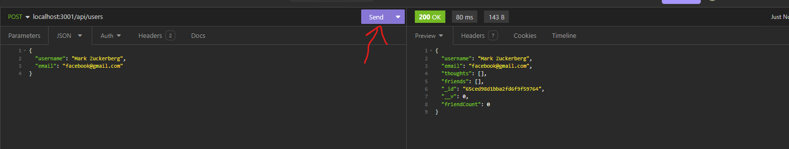
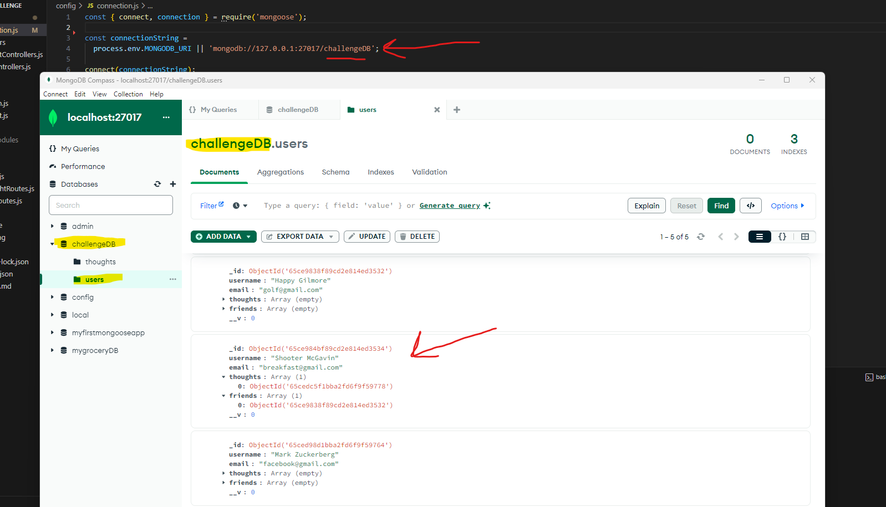

# Social_Networking_API_NoSQL

Welcome to the Social Networking API using NoSQL Mongoose and Mongo Compass database GUI! This API is a demonstration of routing using express server technology to: 

- CREATE, UPDATE, and REMOVE users
- CREATE and REMOVE friends of users
- Users are able to CREATE, UPDATE, and REMOVE thoughts 
- Users are able to then CREATE and REMOVE reactions to other user's thoughts

- NOTE*** friends are sorted in an array associated with users 
- NOTE*** reactions are sorted in an array associated with thoughts
- BOTH are tallied up in a total using mongoose virtuals

ALL of these endpoints are able to be tested and proven in insomnia and video demonstration can be found in the README.md

## User Story

```md
AS A social media startup
I WANT an API for my social network that uses a NoSQL database
SO THAT my website can handle large amounts of unstructured data
```

## Acceptance Criteria

```md
GIVEN a social network API
WHEN I enter the command to invoke the application
THEN my server is started and the Mongoose models are synced to the MongoDB database
WHEN I open API GET routes in Insomnia for users and thoughts
THEN the data for each of these routes is displayed in a formatted JSON
WHEN I test API POST, PUT, and DELETE routes in Insomnia
THEN I am able to successfully create, update, and delete users and thoughts in my database
WHEN I test API POST and DELETE routes in Insomnia
THEN I am able to successfully create and delete reactions to thoughts and add and remove friends to a user’s friend list
```

## Screenshot





## Video Demonstration

https://youtu.be/D-0XF7XmPsw 

## Link To GitHub Repository

https://github.com/waltscode/social_networking_api